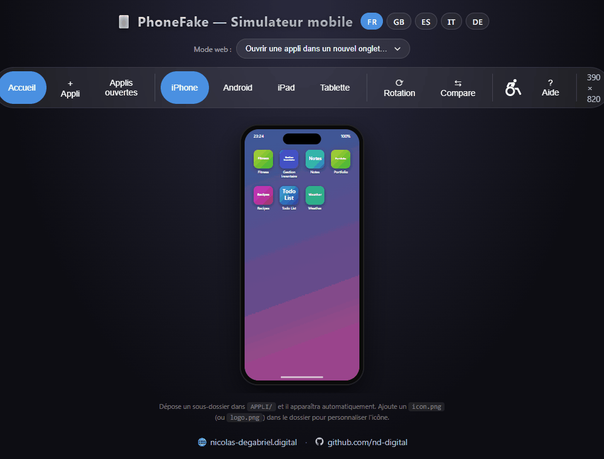
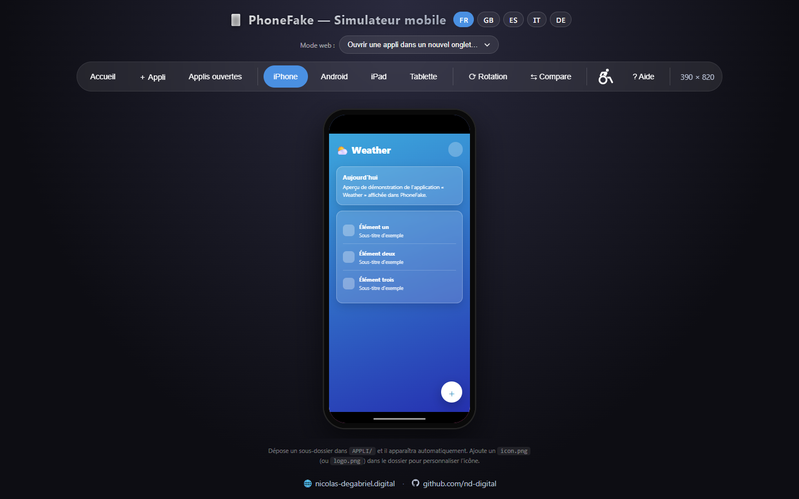
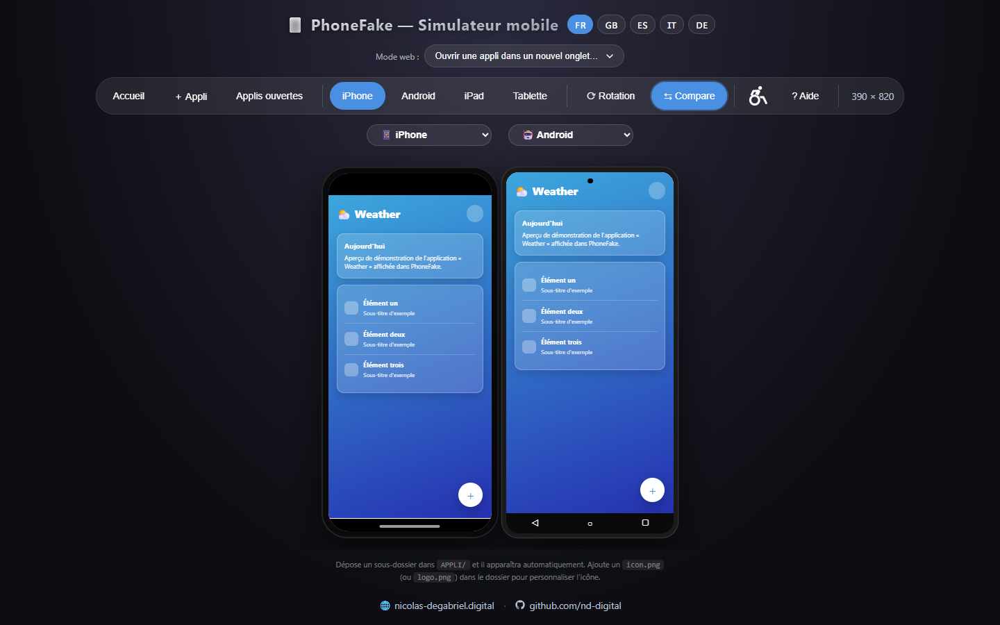
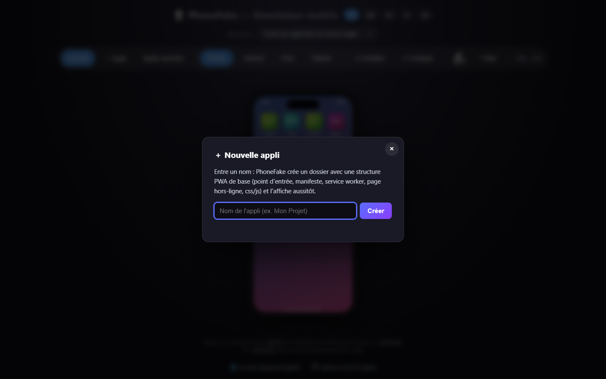
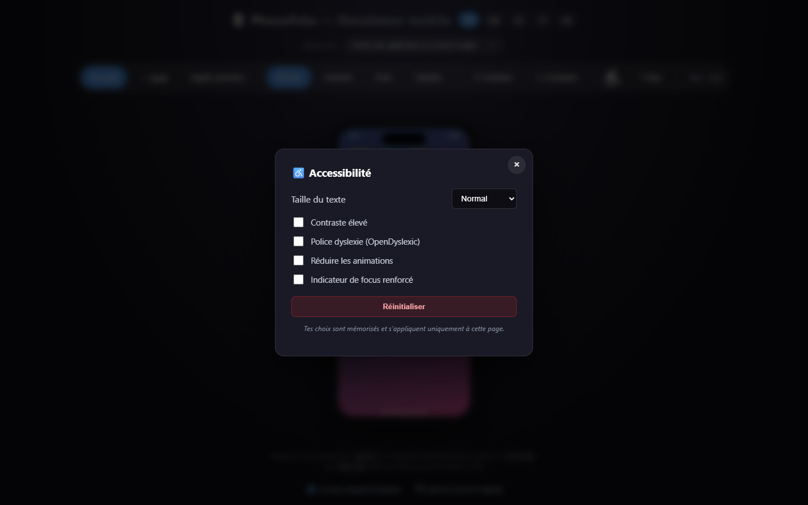

<div align="center">

# 📱 PhoneFake

### Teste tes applis web dans un vrai cadre mobile — en local, sans rien installer.

[](LICENSE)
[](https://github.com/nd-digital/phonefake/releases)
[]()
[]()



</div>

---

## Pourquoi PhoneFake ?

Tester le rendu mobile d'une appli web, c'est souvent : redimensionner la fenêtre à la main, jongler avec les devtools, ou déployer pour voir sur son téléphone. **PhoneFake** te donne un **appareil mobile réaliste directement dans ton navigateur** : notch, barre d'état, navigation, multitâche — et tes applis tournent dedans, en vrai, via des `<iframe>`.

- 🔌 **Zéro installation** — un dossier, un serveur local, c'est tout
- 🏠 **100 % local** — aucun service en ligne, rien ne sort de ta machine
- 🆓 **Open-source (MIT)** — utilise, modifie, partage

---

## ✨ Fonctionnalités

| | |
|---|---|
| 📱 **5 appareils** | iPhone (notch), Android (punch-hole), iPad, tablette Android et **Ordinateur** (écran desktop large) — dimensions natives |
| 🔄 **Rotation** | Bascule portrait ↔ paysage en un clic |
| ⇆ **Comparaison** | Jusqu'à **3 appareils côte à côte** (téléphone, tablette, ordinateur), à la même hauteur — chaque colonne a son sélecteur, avec une option *Désactivé* |
| ⛶ **Agrandissement** | Un bouton à côté de chaque écran l'affiche en grand dans une fenêtre (pleine hauteur), `⤡`/`Échap` pour revenir |
| 🔍 **Zoom** | Un curseur par appareil pour agrandir ; une fois zoomé, glisse dans la fenêtre pour te déplacer (comme un téléphone) et reviens à 100 % pour cliquer |
| 🔄 **Synchro entre écrans** | En comparaison, tes actions (navigation, défilement, clics, saisie) se répercutent sur les autres écrans (agent `phonefake-sync.js`) |
| ⌨️ **Clavier virtuel** | Au focus d'un champ, un clavier monte et **réduit le viewport** (comme un vrai téléphone) — vérifie que tes champs restent visibles |
| 👥 **Compteur live** | Affiche en direct (style split-flap) combien de codeurs utilisent PhoneFake en ce moment — anonyme, aucune donnée perso envoyée, optionnel |
| ➕ **Création d'appli** | Génère un squelette PWA complet depuis l'interface |
| 🎨 **Logos auto-générés** | Une appli sans icône ? Un logo est créé à partir de son nom |
| 🌍 **5 langues** | FR · EN · ES · IT · DE |
| ♿ **Accessibilité** | Taille texte, contraste, police dyslexie, animations réduites |
| ⌨️ **Raccourcis** | `1`-`5` appareils · `R` rotation · `C` comparer · `H` aide · `A` accessibilité |
| 🔔 **Mises à jour** | Bannière en haut si une version plus récente est disponible sur GitHub |
| 📸 **Capture** | Exporte l'écran simulé en PNG (via la capture d'écran native du navigateur) |
| 🪟 **Installable (PWA)** | S'installe comme une appli de bureau (Edge/Chrome) et fonctionne hors-ligne |

---

## 🖼️ Aperçu

<table align="center">
  <tr>
    <td align="center"><b>Appli ouverte</b></td>
    <td align="center"><b>Mode comparaison</b></td>
  </tr>
  <tr>
    <td align="center"></td>
    <td align="center"></td>
  </tr>
  <tr>
    <td align="center"><b>Création d'appli</b></td>
    <td align="center"><b>Accessibilité</b></td>
  </tr>
  <tr>
    <td align="center"></td>
    <td align="center"></td>
  </tr>
</table>

---

## 🚀 Démarrage

1. Place le dossier à la racine de ton serveur web local (Laragon, MAMP, XAMPP, serveur Node…)
2. Ajoute tes applis dans des sous-dossiers à côté de `index.html` (chacune avec son point d'entrée)
3. Ouvre `index.html` dans ton navigateur — tes applis apparaissent automatiquement

> 💡 Pas d'icône dans ton appli ? PhoneFake génère un logo à partir du nom du dossier.
> Tu peux aussi cliquer **➕ Appli** pour générer un squelette PWA prêt à coder.

### Pré-requis
- Un serveur servant `apps.php` (PHP, pour lister les sous-dossiers)
- Un navigateur récent (Chrome 105+, Firefox 121+, Safari 16+ — `:has()` & container queries)

---

## 🧩 Comment ça marche

- **`apps.php`** scanne les sous-dossiers et renvoie la liste des applis (nom, icône, point d'entrée) en JSON. Détection intelligente : manifeste PWA, icônes conventionnelles, redirections, override via `phonefake.json`.
- **`index.html`** est le simulateur complet (HTML/CSS/JS vanilla, zéro dépendance, zéro build) : il met chaque appli dans une `<iframe>` mise à l'échelle, avec un mini-OS mobile (accueil, multitâche, navigation).

---

## 🔄 Synchro entre écrans (mode comparaison)

En comparaison, tes actions dans l'appli — **navigation, défilement, clics, saisie** — sont répercutées en direct sur les autres écrans. Chaque écran étant une `<iframe>` indépendante, un petit **agent** (`phonefake-sync.js`) tourne dans l'appli et rapporte tes actions à PhoneFake, qui les rejoue sur les miroirs.

- **Appli servie sur la même origine que PhoneFake** → l'agent est **injecté automatiquement**, rien à faire.
- **Appli sur une autre origine** (autre port, autre domaine) → le navigateur interdit l'injection ; ajoute **une ligne** dans ton appli (en dev) :

```html
<script src="http://<hôte-phonefake>/APPLI/phonefake-sync.js"></script>
```

L'agent ne fait rien hors d'une iframe PhoneFake et ne communique qu'avec la fenêtre qui l'a chargé.

> ⚠️ **Positionnement.** PhoneFake est un outil de **première approche** (aperçu du rendu et de la mise en page) et un bon support de **démo/présentation**. Il ne remplace pas un test sur **appareil réel** (moteur Safari/Chrome mobile) : les deux sont complémentaires.

---

## 🔔 Mises à jour

Au chargement, PhoneFake compare sa version à la dernière *release* publiée sur GitHub. Si une version plus récente existe, une **bannière** s'affiche en haut de la page avec ta version locale, la version en ligne et un lien vers les [releases](https://github.com/nd-digital/phonefake/releases).

- La vérification se fait au plus une fois toutes les 6 h (cache local) ; aucune donnée n'est envoyée.
- Pour mettre à jour : `git pull` (si cloné) ou télécharge la dernière release et remplace les fichiers.
- La bannière est masquable et n'apparaît qu'une fois par nouvelle version.

> 💡 Pour les contributeurs : pensez à incrémenter `APP_VERSION` dans `index.html` à chaque release.

---

## 🪟 Installer comme application (PWA)

PhoneFake est une **PWA** : tu peux l'installer comme une vraie appli de bureau.

- Dans **Edge / Chrome**, ouvre PhoneFake puis clique sur l'icône d'installation dans la barre d'adresse (ou menu → *Installer PhoneFake*). Il s'ouvre alors dans sa propre fenêtre (menu Démarrer, barre des tâches), sans Electron.
- L'enveloppe (interface) fonctionne **hors-ligne** ; la liste des applis nécessite toujours le serveur PHP local (`apps.php`).

## 📸 Capture d'écran

Le bouton **📸 Capture** exporte l'écran simulé (l'appareil et son contenu) en PNG. La capture utilise l'API native du navigateur : il te demandera une fois quelle surface partager (l'onglet courant est pré-sélectionné).

---

## 📄 Licence

[MIT](LICENSE) — fais-en ce que tu veux.
Traductions (FR · ES · IT · DE, non officielles) : [LICENSE-translations.md](LICENSE-translations.md).

---

<div align="center">

Créé par **Nicolas Degabriel**
🌐 [nicolas-degabriel.digital](https://nicolas-degabriel.digital) · 🐙 [github.com/nd-digital](https://github.com/nd-digital)

⭐ Si PhoneFake t'est utile, mets une étoile au repo !

</div>
