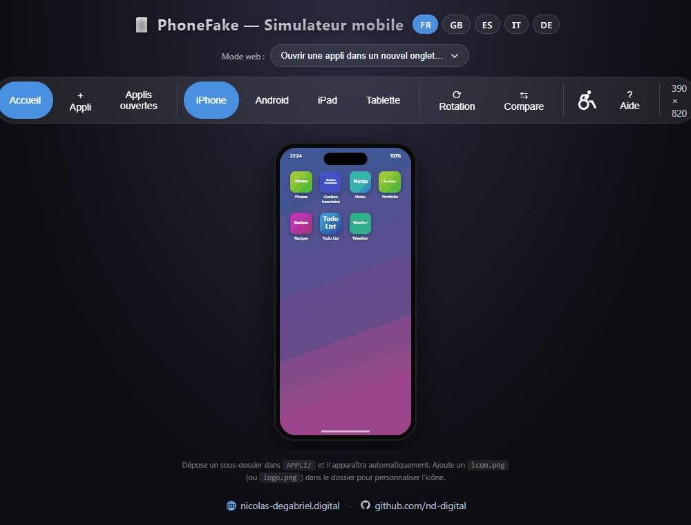
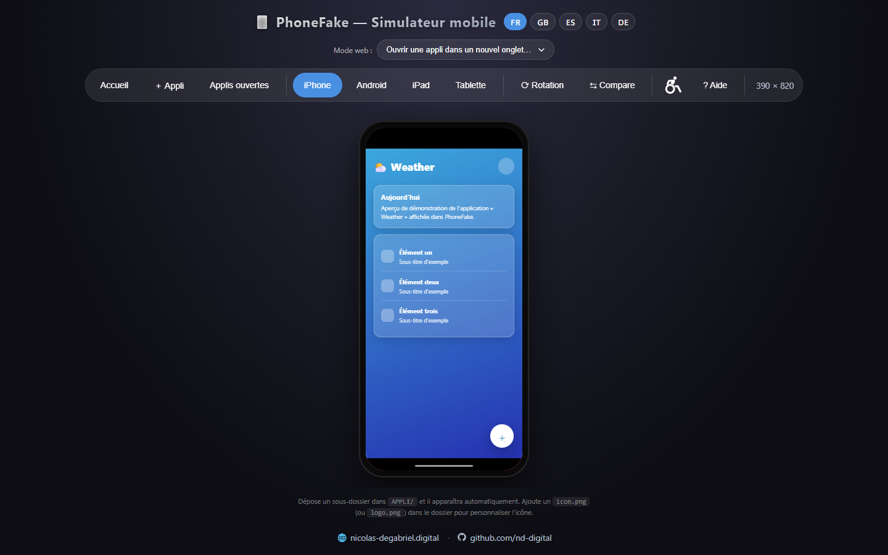
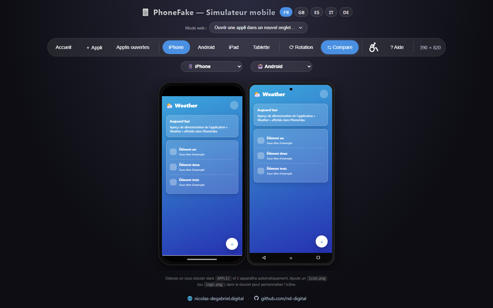
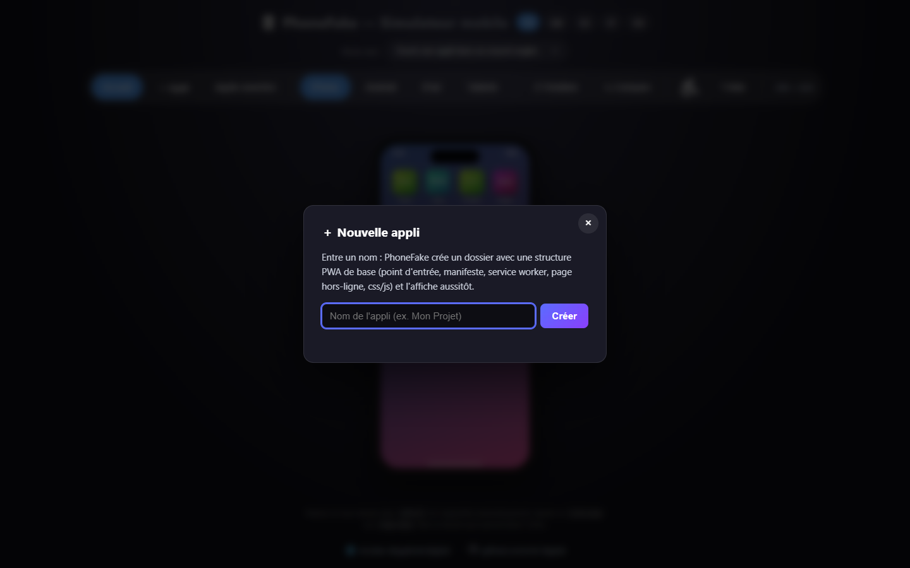
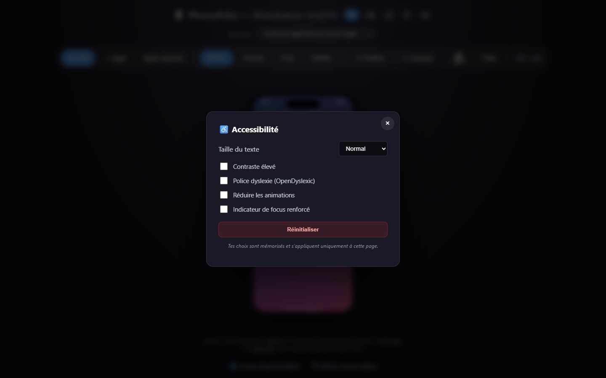

<div align="center">

# 📱 PhoneFake

### Teste tes applis web dans un vrai cadre mobile — en local, sans rien installer.

[](LICENSE)
[](https://github.com/nd-digital/phonefake/releases)
[]()
[]()



</div>

---

## Pourquoi PhoneFake ?

Tester le rendu mobile d'une appli web, c'est souvent : redimensionner la fenêtre à la main, jongler avec les devtools, ou déployer pour voir sur son téléphone. **PhoneFake** te donne un **appareil mobile réaliste directement dans ton navigateur** : notch, barre d'état, navigation, multitâche — et tes applis tournent dedans, en vrai, via des `<iframe>`.

- 🔌 **Zéro installation** — un dossier, un serveur local, c'est tout
- 🏠 **100 % local** — aucun service en ligne, rien ne sort de ta machine
- 🆓 **Open-source (MIT)** — utilise, modifie, partage

---

## ✨ Fonctionnalités

| | |
|---|---|
| 📱 **5 appareils** | iPhone (notch), Android (punch-hole), iPad, tablette Android et **Ordinateur** (écran desktop large) — dimensions natives |
| 🔄 **Rotation** | Bascule portrait ↔ paysage en un clic |
| ⇆ **Comparaison** | Jusqu'à **3 appareils côte à côte** (téléphone, tablette, ordinateur), à la même hauteur — chaque colonne a son sélecteur, avec une option *Désactivé* |
| ⛶ **Agrandissement** | Un bouton à côté de chaque écran l'affiche en grand dans une fenêtre (pleine hauteur), `⤡`/`Échap` pour revenir |
| 🔍 **Zoom** | Un curseur par appareil pour agrandir ; une fois zoomé, glisse dans la fenêtre pour te déplacer (comme un téléphone) et reviens à 100 % pour cliquer |
| 🔄 **Synchro entre écrans** | En comparaison, tes actions (navigation, défilement, clics, saisie) se répercutent sur les autres écrans (agent `phonefake-sync.js`) |
| ⌨️ **Clavier virtuel** | Au focus d'un champ, un clavier monte et **réduit le viewport** (comme un vrai téléphone) — vérifie que tes champs restent visibles |
| 👥 **Compteur live** | Affiche en direct (style split-flap) combien de codeurs utilisent PhoneFake en ce moment — anonyme, aucune donnée perso envoyée, optionnel |
| ➕ **Créer une appli** | Démarreur de projet complet : squelette PWA + **icônes mobiles**, **README / `.gitignore` / LICENSE** (13 licences au choix), **`git init` + 1er commit**, et en option **création + push du dépôt GitHub** (privé/public) — voir la section dédiée plus bas |
| 🎨 **Logos auto-générés** | Une appli sans icône ? Un logo est créé à partir de son nom |
| 🌍 **5 langues** | FR · EN · ES · IT · DE |
| ♿ **Accessibilité** | Taille texte, contraste, police dyslexie, animations réduites, **simulation daltonisme** (protanopie / deutéranopie / tritanopie, sur toute l'interface) |
| ⌨️ **Raccourcis** | `1`-`5` appareils · `R` rotation · `C` comparer · `H` aide · `A` accessibilité |
| 🔔 **Mises à jour** | Bannière en haut si une version plus récente est disponible sur GitHub |
| 📸 **Capture** | Exporte l'écran simulé en PNG (via la capture d'écran native du navigateur) |
| 🪟 **Installable (PWA)** | S'installe comme une appli de bureau (Edge/Chrome) et fonctionne hors-ligne |

---

## 🖼️ Aperçu

<table align="center">
  <tr>
    <td align="center"><b>Appli ouverte</b></td>
    <td align="center"><b>Mode comparaison</b></td>
  </tr>
  <tr>
    <td align="center"></td>
    <td align="center"></td>
  </tr>
  <tr>
    <td align="center"><b>Création d'appli</b></td>
    <td align="center"><b>Accessibilité</b></td>
  </tr>
  <tr>
    <td align="center"></td>
    <td align="center"></td>
  </tr>
</table>

---

## 🚀 Démarrage

1. Place le dossier à la racine de ton serveur web local (Laragon, MAMP, XAMPP, serveur Node…)
2. Ajoute tes applis dans des sous-dossiers à côté de `index.html` (chacune avec son point d'entrée)
3. Ouvre `index.html` dans ton navigateur — tes applis apparaissent automatiquement

> 💡 Pas d'icône dans ton appli ? PhoneFake génère un logo à partir du nom du dossier.
> Tu peux aussi cliquer **➕ Appli** pour générer un squelette PWA prêt à coder.

### Pré-requis
- Un serveur servant `apps.php` (PHP, pour lister les sous-dossiers)
- Un navigateur récent (Chrome 105+, Firefox 121+, Safari 16+ — `:has()` & container queries)

---

## ➕ Créer une appli — démarreur de projet

Le bouton **➕ Appli** ne crée pas qu'un squelette : il génère un **projet complet, prêt pour GitHub**.

**Généré dans un nouveau dossier :**
- une **structure PWA** fonctionnelle : `index.html`, `manifest.json`, `service-worker.js`, page hors-ligne, `css/` et `js/` ;
- des **icônes mobiles** prêtes pour « ajouter à l'écran » (iOS `apple-touch-icon`, Android/PWA `maskable`, favicon) — sinon un **logo auto-généré** depuis le nom ;
- un **README** GitHub-ready, un **`.gitignore`**, et un **`LICENSE`** — au choix parmi **13 licences** (MIT, Apache 2.0, GPL v3/v2, LGPL, AGPL, MPL 2.0, BSD, ISC, Unlicense, Boost, CC0…) ;
- un **dépôt git initialisé** avec un **premier commit**.

**Champs de la fenêtre :** nom, description courte + longue (pour le README), auteur, compte GitHub + nom du projet, licence.

**En option — publier sur GitHub :** coche **« Créer le dépôt sur GitHub »** et PhoneFake **crée le dépôt** (privé ou public — confirmation demandée pour le public) **et pousse le premier commit**, via le [GitHub CLI `gh`](https://cli.github.com/) (il doit être installé et connecté : `gh auth login`).

**Confort :**
- **⚡ Auto-remplir** — un bouton lit le **compte GitHub connecté** sur ta machine (via `gh`) et remplit le pseudo + l'auteur.
- **Compte local** — ton auteur et ton pseudo GitHub sont **mémorisés** (cases *Mémoriser*) dans un fichier local **ignoré par git** : ils **ne quittent jamais ta machine** et ne sont **jamais envoyés sur GitHub**.

> Sans `gh`, la création locale (dossier + git + LICENSE) fonctionne quand même ; seule la partie « dépôt GitHub en ligne » est ignorée.

---

## 🧩 Comment ça marche

- **`apps.php`** scanne les sous-dossiers et renvoie la liste des applis (nom, icône, point d'entrée) en JSON. Détection intelligente : manifeste PWA, icônes conventionnelles, redirections, override via `phonefake.json`.
- **`index.html`** est le simulateur complet (HTML/CSS/JS vanilla, zéro dépendance, zéro build) : il met chaque appli dans une `<iframe>` mise à l'échelle, avec un mini-OS mobile (accueil, multitâche, navigation).

---

## 🖥️ Intégrer une app qui est un **serveur** (Node, pm2…)

PhoneFake sert nativement les apps **statiques** (un dossier avec `index.html`). Mais certaines apps sont un **serveur** tournant sur son propre port — par exemple une app **Node/Express lancée par pm2** sur `http://localhost:3002`. Leur dossier n'a pas d'`index.html` à la racine : Apache n'a rien à servir.

**Symptôme :** à l'ouverture, tu vois une page **« Index of /APPLI/mon-app »** (listing du dossier) au lieu de l'app. Cause : `apps.php` n'a trouvé aucun point d'entrée statique et retombe sur le dossier, qu'Apache affiche en liste.

**Solution : un `phonefake.json` à la racine de l'app**, qui pointe vers le process en cours au lieu du dossier :

```json
{
  "url": "http://localhost:3002",
  "name": "Mon App Node",
  "icon": "public/logo.png"
}
```

| Clé | Rôle |
|---|---|
| `url` | **(requise pour une app serveur)** adresse où tourne le process (le port pm2). PhoneFake charge cette URL dans l'`<iframe>`. |
| `name` | (optionnel) nom affiché dans le sélecteur (sinon déduit du nom de dossier). |
| `icon` | (optionnel) chemin d'une icône, **relatif au dossier de l'app**. |

> ℹ️ L'app doit **tourner** sur ce port (ex. `pm2 start app.js --name mon-app`). PhoneFake ne lance pas le serveur, il s'y **connecte**.
> Comme l'app est sur une **autre origine** (autre port), la [synchro entre écrans](#-synchro-entre-écrans-mode-comparaison) nécessite d'ajouter la ligne `<script src="…/phonefake-sync.js">` dans l'app (en dev).

**⚠️ Éviter le listing du dossier.** Sans `index.html` ni `phonefake.json`, Apache peut **lister le contenu** du dossier (dont `.git/`, `node_modules/`…) — peu discret. Pour l'éviter : soit le `phonefake.json` ci-dessus, soit un `.htaccess` à la racine de l'app avec :

```apache
Options -Indexes
```

---

## 🧭 Intégration au tableau de bord INDEX_LARAGON

PhoneFake se marie avec **[INDEX_LARAGON](https://github.com/nd-digital/INDEX_LARAGON)**, un tableau de bord open-source qui liste tous tes projets locaux (Laragon, MAMP, XAMPP…) sur une seule page. Le bouton **↩ index localhost** (en haut à gauche) y renvoie.

- Si INDEX_LARAGON (ou tout autre index) est installé à la racine de ton `www`, le bouton t'y ramène directement.
- Sinon, au lieu d'un 404, une page t'**invite à l'installer** avec un lien vers son dépôt GitHub.

> Les deux outils sont indépendants : PhoneFake fonctionne très bien seul, INDEX_LARAGON n'est pas requis.

---

## 🔄 Synchro entre écrans (mode comparaison)

En comparaison, tes actions dans l'appli — **navigation, défilement, clics, saisie** — sont répercutées en direct sur les autres écrans. Chaque écran étant une `<iframe>` indépendante, un petit **agent** (`phonefake-sync.js`) tourne dans l'appli et rapporte tes actions à PhoneFake, qui les rejoue sur les miroirs.

- **Appli servie sur la même origine que PhoneFake** → l'agent est **injecté automatiquement**, rien à faire.
- **Appli sur une autre origine** (autre port, autre domaine) → le navigateur interdit l'injection ; ajoute **une ligne** dans ton appli (en dev) :

```html
<script src="http://<hôte-phonefake>/APPLI/phonefake-sync.js"></script>
```

L'agent ne fait rien hors d'une iframe PhoneFake et ne communique qu'avec la fenêtre qui l'a chargé.

> ⚠️ **Positionnement.** PhoneFake est un outil de **première approche** (aperçu du rendu et de la mise en page) et un bon support de **démo/présentation**. Il ne remplace pas un test sur **appareil réel** (moteur Safari/Chrome mobile) : les deux sont complémentaires.

---

## 🩺 Dépannage — l'appli ne s'affiche pas (ou mal) dans PhoneFake

Chaque appli tourne dans une `<iframe>`. Le navigateur applique donc à l'appli les règles d'un site **intégré dans un autre site**, qui ne s'appliquent pas quand on l'ouvre dans un onglet. Si une appli marche dans un onglet mais pas dans PhoneFake, la cause est presque toujours dans cette liste.

### L'appli interdit d'être affichée dans un cadre

**Symptôme :** PhoneFake affiche « Affichage bloqué par l'appli ». Sur une appli d'une autre origine, le navigateur affiche à la place sa propre page d'erreur (`ERR_BLOCKED_BY_RESPONSE`, « localhost a refusé la connexion »…).

**Cause :** l'appli envoie un en-tête anti-*clickjacking* : `X-Frame-Options: DENY` ou `Content-Security-Policy: … frame-ancestors 'none'`. C'est une bonne pratique en production, mais elle bloque aussi PhoneFake.

**Solution :** autoriser la même origine **en local seulement**, et garder la version stricte en production. Exemple Apache (`.htaccess`) :

```apache
<If "%{HTTP_HOST} =~ /^(localhost|127\.0\.0\.1)/">
  Header always set X-Frame-Options "SAMEORIGIN"
  Header always set Content-Security-Policy "… frame-ancestors 'self'"
</If>
<Else>
  Header always set X-Frame-Options "DENY"
  Header always set Content-Security-Policy "… frame-ancestors 'none'"
</Else>
```

> Si l'appli est sur **un autre port** que PhoneFake (app serveur), `SAMEORIGIN` / `'self'` ne suffisent plus : il faut autoriser l'adresse de PhoneFake dans `frame-ancestors` (ex. `frame-ancestors https://localhost`), `X-Frame-Options` ne sachant pas le faire.
>
> PhoneFake ne détecte ce blocage que pour les applis servies **sur la même origine** que lui. Pour les autres, le navigateur ne lui laisse pas lire les en-têtes.

### L'appli « s'échappe » et remplace PhoneFake

**Symptôme :** à l'ouverture de l'appli, toute la page PhoneFake disparaît et l'appli s'affiche en plein onglet.

**Cause :** un script *anti-framing* dans l'appli, du type `if (top !== self) top.location = self.location`.

**Solution :** désactiver ce script en local, ou le remplacer par l'en-tête `frame-ancestors` ci-dessus (plus fiable, et réglable par environnement).

### Contenu mixte : PhoneFake en `https`, appli en `http`

**Symptôme :** l'écran reste vide ou affiche une erreur de connexion.

**Cause :** une page `https` ne peut pas intégrer une page `http`. Quand PhoneFake tourne en `https`, il réécrit automatiquement les adresses `http://localhost…` des applis en `https://…`. Il faut donc que le serveur de l'appli réponde aussi en `https`.

**Solution :** servir l'appli en `https`, ou ouvrir PhoneFake en `http`.

### Certificat local non reconnu

**Symptôme :** l'appli est en `https` sur son propre port (ex. `https://localhost:3002`) et l'écran affiche une erreur de certificat, ou reste vide.

**Cause :** le navigateur n'affiche pas l'avertissement « Continuer vers le site » à l'intérieur d'une iframe.

**Solution :** ouvrir une fois l'adresse de l'appli dans un onglet et accepter le certificat, ou utiliser un certificat local reconnu par la machine (celui de Laragon, [mkcert](https://github.com/FiloSottile/mkcert)…).

### Connexion / session perdue dans l'appli

**Symptôme :** l'appli se connecte dans un onglet, mais dans PhoneFake la session ne tient pas (retour permanent à l'écran de connexion).

**Cause :** si PhoneFake et l'appli ne sont pas sur le **même site**, les cookies de l'appli sont des cookies *tiers*, que les navigateurs bloquent de plus en plus. Attention : `localhost` et `127.0.0.1` sont **deux sites différents** pour le navigateur.

**Solution :** ouvrir PhoneFake et l'appli avec le même nom d'hôte, par exemple `localhost` partout.

### Synchro entre écrans ou clavier virtuel inactifs

**Cause :** l'appli est sur une autre origine, et l'agent de synchro n'a pas pu être injecté.

**Solution :** voir [Synchro entre écrans](#-synchro-entre-écrans-mode-comparaison) : une ligne `<script>` à ajouter dans l'appli.

### Page « Index of… » au lieu de l'appli

**Cause :** le dossier n'a pas d'`index.html` (app serveur Node/pm2).

**Solution :** voir la section *Intégrer une app qui est un serveur*, plus haut : un `phonefake.json` avec l'`url`.

---

## 🔔 Mises à jour

Au chargement, PhoneFake compare sa version à la dernière *release* publiée sur GitHub. Si une version plus récente existe, une **bannière** s'affiche en haut de la page avec ta version locale, la version en ligne et un lien vers les [releases](https://github.com/nd-digital/phonefake/releases).

- La vérification se fait au plus une fois toutes les 6 h (cache local) ; aucune donnée n'est envoyée.
- Pour mettre à jour : `git pull` (si cloné) ou télécharge la dernière release et remplace les fichiers.
- La bannière est masquable et n'apparaît qu'une fois par nouvelle version.

> 💡 Pour les contributeurs : pensez à incrémenter `APP_VERSION` dans `index.html` à chaque release.

---

## 🪟 Installer comme application (PWA)

PhoneFake est une **PWA** : tu peux l'installer comme une vraie appli de bureau.

- Dans **Edge / Chrome**, ouvre PhoneFake puis clique sur l'icône d'installation dans la barre d'adresse (ou menu → *Installer PhoneFake*). Il s'ouvre alors dans sa propre fenêtre (menu Démarrer, barre des tâches), sans Electron.
- L'enveloppe (interface) fonctionne **hors-ligne** ; la liste des applis nécessite toujours le serveur PHP local (`apps.php`).

## 📸 Capture d'écran

Le bouton **📸 Capture** exporte l'écran simulé (l'appareil et son contenu) en PNG. La capture utilise l'API native du navigateur : il te demandera une fois quelle surface partager (l'onglet courant est pré-sélectionné).

---

## 📄 Licence

[MIT](LICENSE) — fais-en ce que tu veux.
Traductions (FR · ES · IT · DE, non officielles) : [LICENSE-translations.md](LICENSE-translations.md).

---

<div align="center">

Créé par **Nicolas Degabriel**
🌐 [nicolas-degabriel.digital](https://nicolas-degabriel.digital) · 🐙 [github.com/nd-digital](https://github.com/nd-digital)

⭐ Si PhoneFake t'est utile, mets une étoile au repo !

</div>
